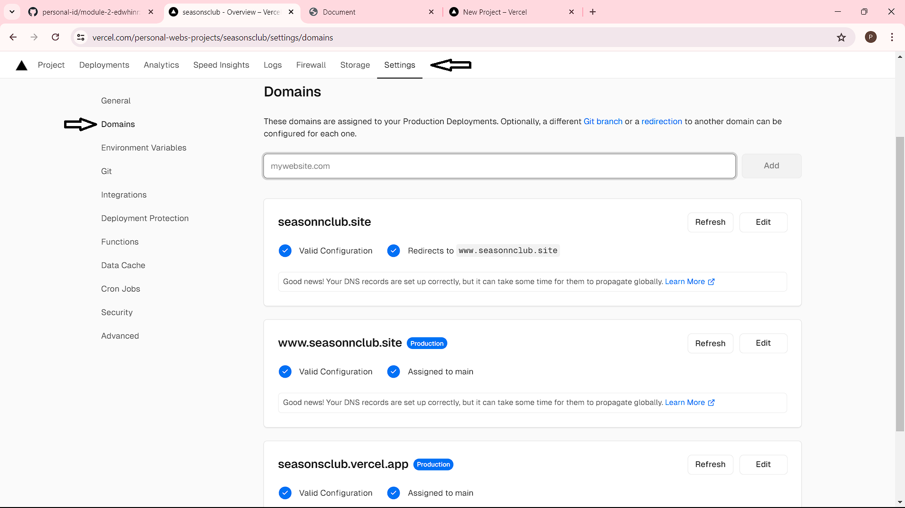
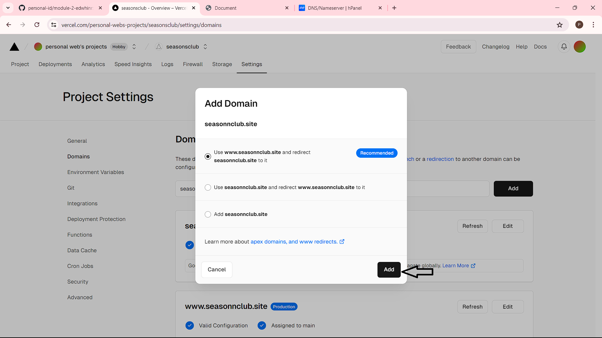

# Hello!!

hi, I'm Edwhin Rantho Rafafi. This marks my milestone 1 project. It's about the company profile of a coal mining company. I hope you like it!

## STRUCTURE 📰

- Logo
- Header
    - Announcement
    - Navbar
- Main
    - introduction-img
    - overview
    - purpose
    - history
    - manager
    - career
    - media
- Footer

## Table of Contents
- HTML
- CSS
- JavaScript
- External/Internal Source
  - Icon
  - Image

## Ways To Connect

In this project, I used Github Desktop as the connector. The advantage of this approach is its user-friendly UI that simplifies usage.

1. Clone Repository

2. And content and push

3. Check in github

## DEPLOYMENT  ⚙️

1. Go to vercel.com

2. Click Log-in

3. Log-in with GitHub

### Deploy on Vercel from GitHub

1. Go to Site, click Add new site, Import an existing project

2. Click deploy with GitHub, and wait for authorizing 

3. Choose the repository

4. Scroll down, Deploy Site
   
### Auto Deploy
   
Once you deploy the site, it will be automatically deployed when you push somethings to your GitHub repository.

### Connecting Domain to Vercel
            
1. Login to your Vercel account, then click your deployed website.
            
2. go to Site overview -> Settings ->  Domain
            

         
4. type your domain name, verify click Add domain, choice the first, and click add.
            

         
5. Wait for awhile and your site is ready to be used.

## Link Deployment

### https://www.seasonnclub.site/

Happy browsing!